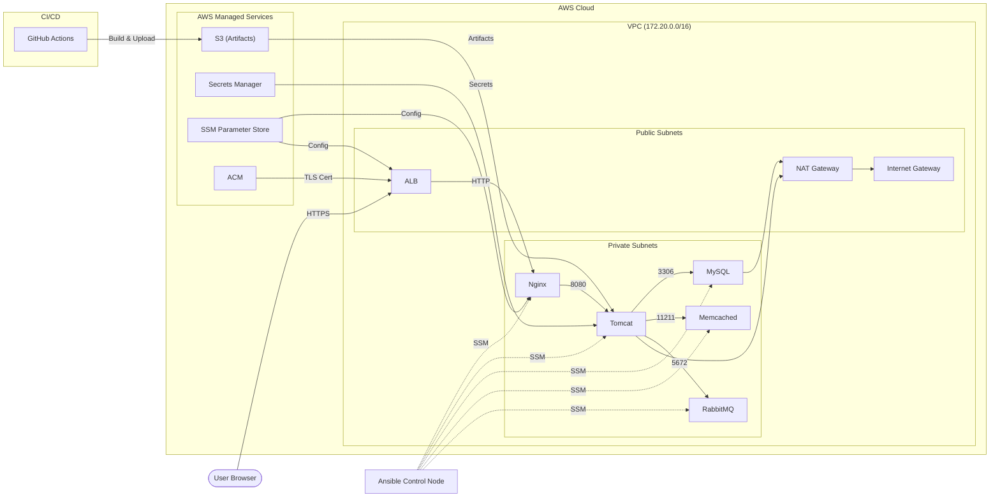

# vprofile-ansible-project

Full AWS infrastructure automation using Ansible — from VPC setup to application deployment.
No SSH, no bastion host, no hardcoded credentials.
 
The project deploys a Java web application (vprofile) on AWS across three availability zones,
covering both infrastructure provisioning and service configuration in a single codebase.

---

## Architecture
 


### Request flow

1. Browser hits the ALB over HTTPS — ACM handles TLS termination.
2. HTTP is redirected to HTTPS at the listener level.
3. ALB forwards to Nginx (private subnet), which reverse-proxies to Tomcat on `:8080`.
4. Tomcat talks to MySQL for persistence, Memcached for query caching, and RabbitMQ for async messaging.

### No SSH, no bastion

Operator access goes through AWS Systems Manager Session Manager only. Instances have no inbound rules on port 22, no key pairs distributed, and every session is automatically logged in CloudTrail. Access control is IAM-only.

---


## Tech stack
 
- **Ansible** — infrastructure provisioning + configuration management
- **AWS** — VPC, EC2, ALB, NAT Gateway, Route 53, ACM, SSM, Secrets Manager, S3
- **GitHub Actions** — builds the WAR artifact and uploads it to S3
- **Services** — Tomcat 9, Nginx, MySQL 8.0, Memcached, RabbitMQ

---

## Project Structure

```
ansible-vpc-project/
├── .github/workflows/build.yml     # CI: build WAR, upload to S3
├── group_vars/all.yml              # Global vars: region, SSM connection, bucket
├── inventories/
│   ├── localhost.yml               # Phase 1 & 2 (API calls from control node)
│   └── aws_ec2.yml                 # Phase 3 (dynamic inventory by Role tag)
├── roles/
│   ├── vpc/                        # VPC, subnets, IGW, NAT, route tables
│   ├── ssm_access/                 # IAM profile + SSM connectivity check
│   ├── stack_infra/                # Security groups, EC2 instances, ALB
│   │   └── tasks/
│   │       ├── security_groups.yml
│   │       ├── ec2_instances.yml
│   │       └── load_balancer.yml
│   └── stack_provision/            # Install & configure all services
│       ├── tasks/                  # mysql · memcache · rabbitmq · tomcat · nginx
│       ├── templates/              # application.j2 · nginxvpro.j2 · tomcat.service.j2
│       └── handlers/main.yml       # Service restarts on config change
├── vpc.yml                         # Phase 1 entry point
├── stack_infra.yml                 # Phase 2 entry point
└── site.yml                        # Phase 3 entry point
```

---

## Prerequisites

- AWS account with permissions for EC2, VPC, IAM, S3, SSM, Secrets Manager, ACM, Route 53, ALB
- Ansible control node (EC2 instance) with the `vprofile-ssm-role` IAM profile attached
- Registered domain + Route 53 hosted zone (for ACM DNS validation)
- Two secrets in Secrets Manager:

```bash
aws secretsmanager create-secret --name dev/vprofile/mysql \
  --secret-string '{"db_user":"...","db_pass":"...","db_name":"accounts"}'

aws secretsmanager create-secret --name dev/vprofile/rabbitmq \
  --secret-string '{"rmq_user":"...","rmq_pass":"..."}'
```

- Dependencies on the control node:

```bash
pip install ansible boto3 botocore
ansible-galaxy collection install amazon.aws community.aws
# SSM Session Manager plugin
curl "https://s3.amazonaws.com/session-manager-downloads/plugin/latest/ubuntu_64bit/session-manager-plugin.deb" \
  -o ssm-plugin.deb && sudo dpkg -i ssm-plugin.deb
```

---

## Deployment

```bash
git clone https://github.com/SafouaneHaddadi/ansible-vpc-project.git
cd ansible-vpc-project
```

### Phase 1 — Network

Creates the VPC, subnets, Internet Gateway, NAT Gateway, and route tables. Stores all resource IDs in SSM Parameter Store.

```bash
ansible-playbook vpc.yml -i inventories/localhost.yml
```

### Phase 2 — Infrastructure

Creates security groups, EC2 instances, and the ALB. Reads VPC IDs from SSM automatically.

```bash
ansible-playbook stack_infra.yml -i inventories/localhost.yml
```

Verify SSM connectivity before Phase 3:

```bash
ansible -i inventories/aws_ec2.yml all -m ping
```

### Phase 3 — Application

Installs and configures all services, deploys the WAR, and wires everything together.

```bash
ansible-playbook site.yml -i inventories/aws_ec2.yml
```

Provisioning order is fixed: **MySQL → Memcached → RabbitMQ → Tomcat → Nginx**. Tomcat needs the database reachable on startup; Nginx comes last so traffic only flows once the full backend is ready.

Get the application URL:

```bash
aws ssm get-parameter --name "/vprofile/dev/alb/dns_name" --query "Parameter.Value" --output text
```

Default login: `admin_vp` / `admin_vp`

---

## Design Choices

**Session Manager over a bastion host** — a bastion requires a running instance, an open port 22, and distributed SSH keys. Session Manager needs none of that. Connections go through the AWS API, access is IAM-controlled, and every session is logged automatically.

**Secrets Manager over Ansible Vault** — Vault works, but the vault password itself needs managing and sharing. Secrets Manager keeps credentials in a service with IAM access control, rotation support, and an audit trail — accessible to any future tool in the same account without sharing a file.

**Dynamic inventory over static IPs** — private IPs change when instances restart. The `amazon.aws.aws_ec2` plugin queries the AWS API at runtime and groups instances by their `Role` tag, so the inventory is always accurate with no maintenance.

**SG-to-SG rules over CIDR ranges** — each service tier has its own security group, and ingress rules reference the upstream SG rather than an IP range. Instance replacements don't require rule changes — membership in the source group is enough.

**SSM Parameter Store for inter-phase IDs** — the three playbook phases run independently. Phase 2 needs the VPC ID from Phase 1; Phase 3 needs instance IPs from Phase 2. SSM Parameter Store is the handoff point, making phases fully decoupled and the IDs available to any other tool in the account.

---

## Known Limitations

**Single NAT Gateway** — one NAT in `us-east-1a` for cost. Production should have one per AZ to avoid cross-AZ traffic charges and to contain AZ failures. The route table tasks are structured to support this with minimal changes.

**Ansible for both infra and config** — used intentionally for learning. In production, I would use Terraform for infrastructure and Ansible for configuration. However, I plan to revisit this project and rebuild the infrastructure with Terraform to deepen my understanding.

**No auto-scaling** — fixed EC2 instances. RDS, ElastiCache, and ASGs are the natural next steps for a production-ready version.

---

## Cleanup

```bash
# Terminate EC2 instances
aws ec2 terminate-instances --instance-ids \
  $(aws ec2 describe-instances \
    --filters "Name=tag:ManagedBy,Values=ansible" "Name=instance-state-name,Values=running" \
    --query "Reservations[*].Instances[*].InstanceId" --output text)

# Delete ALB, NAT Gateway, VPC (in that order)
# Then empty and delete S3 buckets, SSM parameters, and Secrets Manager secrets
```

---
## License

This is a personal portfolio project created to showcase my skills and competencies.
